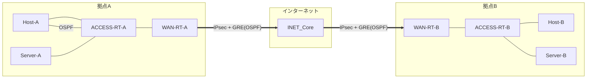

# 2拠点間 IPsec + GRE(OSPF) 接続ネットワーク 基本設計書

- **対象トポロジー**: [`ipsec_gre_ospf_topology.yml`](../examples/ipsec_gre_ospf_topology.yml)
- **版数**: 1.0
- **ステータス**: 設計・トポロジー定義のみ（GNS3実機での検証は未実施。検証手順は
  [詳細設計書 6章](./ipsec-gre-ospf-detailed-design.md#6-試験項目計画) および
  [構築手順書](./ipsec-gre-ospf-construction-guide.md) を参照）

拠点A・拠点Bの2拠点間を、インターネット経由のIPsecで保護したGREトンネルで接続し、
トンネル区間でOSPFを流すことで拠点間の経路交換を行う。各拠点内は、hostを収容する区間は
OSPFで動的に、serverを収容する区間はstatic routeで明示的に経路管理する方針とする。

## 目次

1. [システム概要](#1-システム概要)
2. [ネットワーク全体構成](#2-ネットワーク全体構成)
3. [機器一覧・役割](#3-機器一覧役割)
4. [拠点間接続方式](#4-拠点間接続方式)
5. [拠点内設計方針](#5-拠点内設計方針)
6. [セキュリティ方針](#6-セキュリティ方針)
7. [前提条件・制約事項](#7-前提条件制約事項)

## 1. システム概要

### 1.1 目的

拠点A・拠点B間を、専用線やMPLS網を使わずインターネット経由で安全に接続する。トンネル区間を
OSPFの制御プレーンに組み込むことで、拠点内の経路情報（host/serverセグメント）を拠点間で
自動的に交換できるようにする。

- 🔒 **暗号化**: IPsec（IKEv1 + ESP）により拠点間トラフィックを保護
- 🔁 **経路交換の透過性**: GREでOSPFをカプセル化し、トンネル区間もIGPの一部として扱う
- 🗂️ **拠点内の経路管理方針の使い分け**: hostは動的（OSPF）、serverは静的（static route）

### 1.2 適用範囲

拠点Aエッジルーター（`WAN-RT-A`）・拠点Bエッジルーター（`WAN-RT-B`）、両拠点のアクセス
ルーター（`ACCESS-RT-A` / `ACCESS-RT-B`）、および両拠点のhost/serverセグメントを対象とする。
インターネット区間（`INET_Core`）自体の帯域・冗長性は本書のスコープ外とする。

## 2. ネットワーク全体構成

拠点Aと拠点Bのエッジルーター（WAN-RT）は、インターネット想定の共有セグメント（`INET_Core`）
を介してIPsecトンネルを確立し、その上にGREトンネル（Tunnel0）を張る。GRE区間ではOSPFを
有効化し、拠点内のアクセスルーター（ACCESS-RT）配下のhost/serverセグメントの到達性を
拠点間で交換する。

## 3. 機器一覧・役割

| 機器名 | 役割 | 機種（テンプレート） | 設置拠点 |
|---|---|---|---|
| `WAN-RT-A` | 拠点Aエッジルーター（IPsec/GRE終端、OSPF） | Cisco IOSv 15.9(3)M12 | 拠点A |
| `WAN-RT-B` | 拠点Bエッジルーター（IPsec/GRE終端、OSPF） | Cisco IOSv 15.9(3)M12 | 拠点B |
| `ACCESS-RT-A` | 拠点Aアクセスルーター（host/server収容） | Cisco IOSv 15.9(3)M12 | 拠点A |
| `ACCESS-RT-B` | 拠点Bアクセスルーター（host/server収容） | Cisco IOSv 15.9(3)M12 | 拠点B |
| `INET_Core` | インターネット代替セグメント（IPsec対向点） | Ethernet switch | — |
| `Host-A` / `Host-B` | 拠点内の一般端末（OSPFで到達性を広告） | VPCS | 拠点A / 拠点B |
| `Server-A` / `Server-B` | 拠点内のサーバー（static routeで到達性を確保） | VPCS | 拠点A / 拠点B |

## 4. 拠点間接続方式

拠点間はIPsecで保護したGREトンネル1本のみで接続するシンプル構成とする（冗長経路は持たない）。

| レイヤ | 方式 | 説明 |
|---|---|---|
| 暗号化 | IPsec（IKEv1、トランスポートモード） | `WAN-RT-A` ⇔ `WAN-RT-B` 間のGREパケットをESPで保護 |
| トンネリング | GRE（Tunnel0） | OSPFを含むIPパケットを透過的にカプセル化 |
| 経路制御 | OSPF（area 0、単一エリア） | GRE区間・WAN-RT-ACCESS-RT間・hostセグメントを収容 |

IPsecはGREペイロードの暗号化のみを担い、経路制御には関与しない。OSPFのネイバー関係は
Tunnel0インターフェース上で確立され、IPsecの状態（SA確立の有無）がGREの疎通性、ひいては
OSPFネイバーの生死に直結する。

## 5. 拠点内設計方針

各拠点はWAN-RT配下にアクセスルーター（ACCESS-RT）を1台設置し、host/serverの収容を
ACCESS-RTに一元化する。host/serverでは経路広告の方式を意図的に使い分ける。

| 収容対象 | 経路広告方式 | 狙い |
|---|---|---|
| host（一般端末） | OSPF（動的） | 端末セグメントの増減にネットワーク側の追加設定なしで追従できるようにする |
| server（サーバー） | static route（静的、WAN-RTで`redistribute`） | サーバーセグメントの到達経路を明示管理し、OSPFの動的な再計算対象から意図的に外す。ACCESS-RT自体は直接接続のため設定不要で、WAN-RT側にACCESS-RTを次ホップとする経路を1本だけ追加すればよい |

サーバーセグメントを拠点間で到達可能にするため、WAN-RTでは `redistribute static subnets` を
OSPFプロセスに設定し、static routeをOSPF外部経路（O E2）として対向拠点へ広告する。詳細は
[詳細設計書 3章](./ipsec-gre-ospf-detailed-design.md#3-ルーティング設計)を参照。

## 6. セキュリティ方針

拠点間はインターネットを経由するため、GREでカプセル化したOSPF制御パケット・拠点間データ
通信をすべてIPsec（トランスポートモード）で暗号化・完全性保護する。

| 項目 | 設定値 |
|---|---|
| 鍵交換（IKEv1） | `AES-256` / `SHA-256` / DHグループ `14` / 事前共有鍵 |
| データ保護（IPsec） | `ESP AES-256` + `HMAC-SHA256`、トランスポートモード |
| 保護対象 | Tunnel0（GRE）を通過する拠点間IP通信全て（OSPF制御パケットを含む） |
| serverセグメントの分離 | OSPFのネットワーク文に含めないことで、動的な経路広告経路からは切り離し、経路の存在をWAN-RTのstatic route 1行で明示管理する |

## 7. 前提条件・制約事項

- 本設計はGNS3上のシミュレーション環境（Cisco IOSv）を前提としたトポロジー定義であり、
  本書作成時点でGNS3実機上での検証は行っていない（検証手順は
  [詳細設計書 6章](./ipsec-gre-ospf-detailed-design.md#6-試験項目計画)、実施方法は
  [構築手順書](./ipsec-gre-ospf-construction-guide.md)を参照）。
- 拠点間の帯域・遅延特性はインターネット経路の実態に依存するため、本設計の対象外とする。
- WAN-RT/ACCESS-RTはQEMU系ノードのため、`gns3lab` によるCLI自動投入は非対応。設定は
  GNS3コンソールから手動投入する運用を前提とする（Host/ServerのVPCSは自動投入対応）。
- 拠点間はGREトンネル1本のみの単一経路構成であり、冗長経路（バックアップ回線等）は
  持たない。冗長化が必要な場合は [`wan_gre_mpls_redundancy.yml`](../examples/wan_gre_mpls_redundancy.yml)
  の設計を参照。

---

続きは [詳細設計書](./ipsec-gre-ospf-detailed-design.md) を参照。
