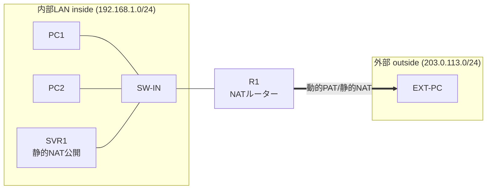

# NAT (PAT/静的NAT) 検証ネットワーク 基本設計書

- **対象トポロジー**: [`nat_topology.yml`](../examples/nat_topology.yml)
- **版数**: 1.0
- **ステータス**: 静的NATはGNS3実機検証済み（動的PATは未検証。試験結果は[詳細設計書](./nat-detailed-design.md#5-試験項目結果)を参照）

内部LAN上の複数クライアントおよび公開サーバーを、1台のNATルーター配下でインターネット（模擬）と接続するための全体方針を定める。動的PAT（ポートアドレス変換）と静的NATという性質の異なる2方式を同一ルーター上で共存させ、それぞれの動作の違いを検証できる構成とする。

## 目次

1. [システム概要](#1-システム概要)
2. [ネットワーク全体構成](#2-ネットワーク全体構成)
3. [機器一覧・役割](#3-機器一覧役割)
4. [NAT方式](#4-nat方式)
5. [セキュリティ方針](#5-セキュリティ方針)
6. [前提条件・制約事項](#6-前提条件制約事項)

## 1. システム概要

### 1.1 目的

プライベートアドレスを持つ内部LANから、グローバル（模擬）アドレスの外部ネットワークへ通信するための代表的な2つのNAT方式を実機で構築・比較する。

- 🔵 **動的PAT（overload）**: 複数の内部クライアントが1つの外部アドレスをポート番号で共有し、外部へアウトバウンド通信する
- 🟠 **静的NAT**: 内部サーバーに固定の外部アドレスを1:1で割り当て、外部からのインバウンド通信を可能にする

### 1.2 適用範囲

NATルーター（R1）と内部LANセグメント、外部（模擬インターネット）セグメントを対象とする。外部ネットワーク側のルーティング設計（ISP経路等）は本書のスコープ外とする。

## 2. ネットワーク全体構成

内部LAN上の一般クライアント（PC1/PC2）と公開サーバー（SVR1）はスイッチ（SW-IN）経由でNATルーター（R1）に接続され、R1の外部インターフェースを介して外部ホスト（EXT-PC）と通信する。

## 3. 機器一覧・役割

| 機器名 | 役割 | 機種（テンプレート） | セグメント |
|---|---|---|---|
| `PC1` / `PC2` | 内部LAN一般クライアント（動的PAT経由で外部通信） | VPCS | inside |
| `SVR1` | 内部LAN公開サーバー（静的NATで外部から到達可能） | VPCS | inside |
| `SW-IN` | 内部LANアクセススイッチ | Ethernet switch | inside |
| `R1` | NATルーター（inside/outside境界、PAT + 静的NAT実施） | Cisco IOSv 15.9(3)M12 | inside/outside境界 |
| `EXT-PC` | インターネット上のホストを模したノード | VPCS | outside |

## 4. NAT方式

| 方式 | 対象 | 変換規則 | 用途 |
|---|---|---|---|
| 🔵 動的PAT（overload） | PC1 / PC2 | `192.168.1.0/24` → `203.0.113.1`（ポート単位で共有） | 内部クライアントのアウトバウンド通信 |
| 🟠 静的NAT | SVR1 | `192.168.1.100` ⇔ `203.0.113.100`（1:1固定） | 内部サーバーの外部公開（インバウンド許可） |

### 4.1 優先順位

動的PATのACLは内部セグメント全体（`192.168.1.0/24`）を対象に定義するが、Cisco IOSの仕様上**静的NATは動的PATより常に優先**される。そのためSVR1（`.100`）宛の変換はACLの対象に含まれていても実際には使われず、PC1/PC2のみが実質的に動的PAT（overload）の対象となる。

## 5. セキュリティ方針

NAT自体はファイアウォールではないが、アドレス変換の副次効果として以下の到達性制御が成立する。

| 通信方向 | 到達性 | 理由 |
|---|---|---|
| inside → outside | ✅ 到達可能 | 動的PAT/静的NATにより変換される |
| outside → SVR1（静的NAT対象） | ✅ 到達可能 | 静的1:1変換により常時到達可能（全ポート） |
| outside → PC1/PC2（内部アドレス直接） | ❌ 到達不可 | 対応する変換エントリが存在しないため |

- 静的NAT対象のSVR1は**全ポートが双方向到達可能**な1:1変換であり、特定ポートのみを公開するポートフォワーディング（PAT static port等）は本設計のスコープ外とする。
- 外部から内部への到達制御をACLで明示的に絞り込む場合は、別途 `ip nat` に加えて `access-list` によるトラフィックフィルタを追加設計する必要がある（本設計では未実施）。

## 6. 前提条件・制約事項

- 本設計はGNS3上のシミュレーション環境（Cisco IOSv）で検証する。実機との細部の挙動差異（ライセンス制約・ASIC実装差等）は別途確認が必要。
- R1はQEMU系ノード（Cisco IOSv）のため、`gns3lab deploy` によるCLI自動投入は非対応。設定はGNS3コンソールから手動投入する運用を前提とする（PC1/PC2/SVR1/EXT-PCはVPCSのため自動投入される）。
- 外部（outside）セグメントはRFC5737の検証用アドレス（`203.0.113.0/24`）を使用し、実在するインターネット上のアドレスとは無関係。

---

続きは [詳細設計書](./nat-detailed-design.md) を参照。
