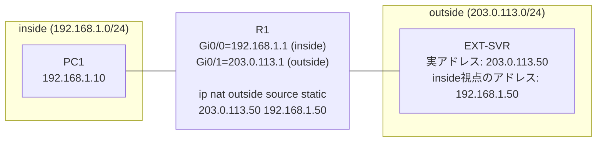
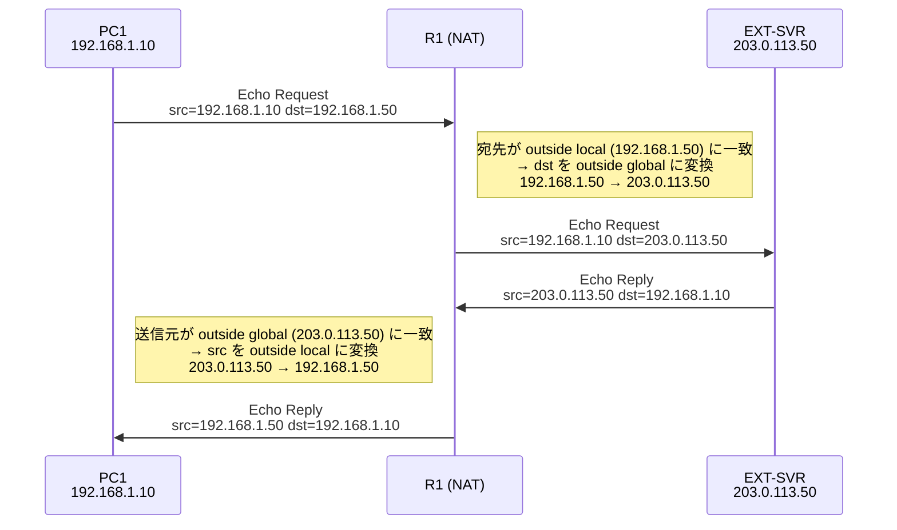
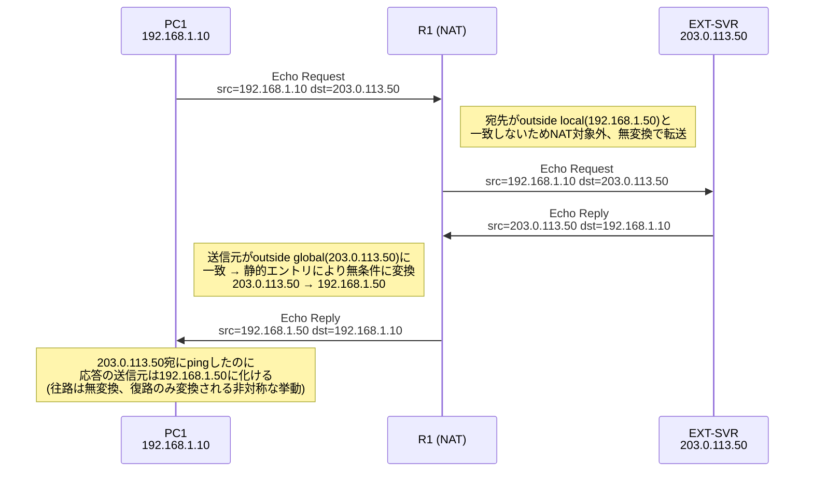

# 静的NAT (outside方向) パケットフロー資料

- **対象トポロジー**: [`static_nat_outside_topology.yml`](../examples/static_nat_outside_topology.yml)
- **対象コマンド**: `ip nat outside source static 203.0.113.50 192.168.1.50`

内部LAN上のPC1から見て、外部(outside)の実サーバーEXT-SVR（実アドレス `203.0.113.50`）が
`192.168.1.50` という別名アドレスに見えるようにする設定。実際にどのホップでどちらの
ヘッダが書き換わるかをパケット単位で図示する。

## 0. 構成とアドレス



| 用語 | 値 | 意味 |
|---|---|---|
| outside global | `203.0.113.50` | EXT-SVRが実際に持つアドレス |
| outside local | `192.168.1.50` | inside側から見たときのEXT-SVRの代理アドレス |

## 1. シナリオ① `PC1 -> ping 192.168.1.50`（NAT経由でアクセス）

行きは宛先（destination）が、帰りは送信元（source）が書き換わる。



| ホップ | 送信元(src) | 宛先(dst) | R1での変換 |
|---|---|---|---|
| PC1 → R1 (Gi0/0) | 192.168.1.10 | 192.168.1.50 | — |
| R1 (Gi0/1) → EXT-SVR | 192.168.1.10 | **203.0.113.50**（変換後） | dst: outside local→global |
| EXT-SVR → R1 (Gi0/1) | 203.0.113.50 | 192.168.1.10 | — |
| R1 (Gi0/0) → PC1 | **192.168.1.50**（変換後） | 192.168.1.10 | src: outside global→local |

PC1からは「192.168.1.50から応答が返ってきた」ように見え、実際の通信相手（203.0.113.50）は隠蔽される。

## 2. シナリオ② `PC1 -> ping 203.0.113.50`（実アドレスへ直接アクセス）

> **GNS3実機検証の結果、この宛先へのpingはタイムアウトする**（詳細は5章）。
> R1自体はパケットを正常に往復させている（`show ip nat translations verbose`で
> 動的extendedエントリの生成/期限切れとHitsカウンタの増加を確認済み）が、応答パケットの
> 送信元が静的NATにより`192.168.1.50`へ書き換わるため、PC1(VPCS)のping実装が
> 「203.0.113.50宛に送ったのに送信元が一致しない」として応答を破棄していると考えられる。
> 以下の図・表は変換ロジック自体の説明であり、pingの成否は5章の実測結果を参照。

inside/outsideのアドレス空間が重複していないため経路的には直接届くが、
**静的エントリはアドレスが一致すれば常に無条件で適用される**ため、
往路と復路で非対称な挙動になる点に注意。



| ホップ | 送信元(src) | 宛先(dst) | R1での変換 |
|---|---|---|---|
| PC1 → R1 (Gi0/0) | 192.168.1.10 | 203.0.113.50 | — |
| R1 (Gi0/1) → EXT-SVR | 192.168.1.10 | 203.0.113.50 | なし（宛先がoutside localと不一致） |
| EXT-SVR → R1 (Gi0/1) | 203.0.113.50 | 192.168.1.10 | — |
| R1 (Gi0/0) → PC1 | **192.168.1.50**（変換後） | 192.168.1.10 | src: outside global→local（無条件） |

> **ポイント**: `ip nat outside source static` は特定フロー（セッション）単位ではなく、
> 一致するアドレスを持つパケットに対して常に適用される固定バインディングである。
> そのためPC1が実アドレス `203.0.113.50` 宛に直接pingしても、EXT-SVRからの応答パケットが
> R1のoutsideインターフェースを通過する時点で無条件に送信元が書き換えられ、
> PC1には `192.168.1.50` からの応答として届く。GNS3実機のVPCSではこの送信元不一致により
> pingがタイムアウト扱いになることを確認済み（5章）。ICMPの応答照合をID/シーケンス番号
> のみで行い送信元アドレスを見ないクライアント実装であれば到達確認自体は成功しうるが、
> それは実装依存であり本トポロジーのVPCSでは失敗する、という点に注意。

## 3. NAT変換テーブル（`show ip nat translations`）

静的エントリのため通信の有無に関わらず常に存在する（`---`表記）。

```
Pro  Inside global      Inside local       Outside local      Outside global
---  ---                ---                192.168.1.50       203.0.113.50
```

- Inside global / Inside local は本トポロジーでは未使用のため空欄（`---`）のまま。
- Outside local (`192.168.1.50`) と Outside global (`203.0.113.50`) の対応のみが常時登録される。
- `show ip nat statistics` では `Total active translations: 1 (1 static, 0 dynamic; ...)` のように
  static 1件としてカウントされる。

## 4. まとめ

| 通信 | 経路上のNAT変換 | R1でのパケット往復 | PC1のping結果(実測) |
|---|---|---|---|
| PC1 → `192.168.1.50` | 往路: dst変換 / 復路: src変換 | 正常 | ✅ 成功（対称） |
| PC1 → `203.0.113.50` | 往路: 変換なし / 復路: src変換 | 正常 | ❌ タイムアウト（非対称、5章参照） |

`ip nat outside source static` が存在する限り、outside globalアドレス（`203.0.113.50`）を
送信元とする戻りパケットは、経路や宛先に関わらず常にoutside localアドレス（`192.168.1.50`）へ
変換される。R1自身のNATテーブル上はどちらの通信もEXT-SVRとの往復が成立しているが、
**PC1(VPCS)のping結果としては、outside-localアドレス宛にアクセスした場合のみ成功する**
という点が本トポロジーの挙動理解における最重要ポイントとなる。

## 5. GNS3実機検証結果

- **検証日**: 2026-07-25
- **環境**: GNS3実機（`static_nat_outside_lab`、R1 = Cisco IOSv 15.9(3)M12）
- **R1投入コンフィグ**: `ip nat outside source static 203.0.113.50 192.168.1.50 no-alias add-route`
  （`no-alias`で暗黙のARPエイリアスを無効化し、`add-route`でoutside-local宛の経路を自動追加）

| No | 試験項目 | 期待結果 | 実施結果 | 判定 |
|---|---|---|---|---|
| 1 | R1 `show ip route 192.168.1.50` | `add-route`により`192.168.1.50/32 via 203.0.113.50`の静的経路が自動追加されている | `S 192.168.1.50/32 [1/0] via 203.0.113.50` を確認 | ✅ 合格 |
| 2 | PC1 → `ping 192.168.1.50`（outside static NAT経由） | 成功、応答元は192.168.1.50 | 5/5成功（1.3〜3.8ms）、応答元 `192.168.1.50` | ✅ 合格 |
| 3 | PC1 → `ping 203.0.113.50`（実アドレスへ直接） | （設計上は到達可能なはずだが）応答元アドレスが非対称になる影響を要確認 | 4〜5/5 **タイムアウト**。ただしR1側では`show ip nat translations verbose`でicmpの動的extendedエントリ（例: `icmp 192.168.1.10:38714 ... 192.168.1.50:38714 203.0.113.50:38714`）が生成・期限切れを繰り返し、Hitsカウンタも増加しており、パケット自体は正常にR1を往復している。PC1(VPCS)が応答元(192.168.1.50)と送信先(203.0.113.50)の不一致を理由に応答を破棄しているとみられる | ⚠️ 到達性としては失敗（原因は非対称変換によるクライアント側の照合ミスマッチ） |
| 4 | R1 `show ip nat translations` | `--- --- 192.168.1.50 203.0.113.50` の静的エントリが常時存在 | 確認済み | ✅ 合格 |
| 5 | R1 `show ip nat statistics` | static 1件 + 試験2/3で動的extendedエントリが生成される、Misses: 0 | `Total active translations: 16 (1 static, 15 dynamic; 15 extended)` / `Hits: 277  Misses: 0` | ✅ 合格 |

**わかったこと**: `ip nat outside source static`（`no-alias add-route`付き）自体は設計通りに
機能しており、R1のNATテーブル・経路・統計はすべて期待通り。一方で、**実アドレス
（outside global）へ直接pingするテストは、この構成では失敗として観測される**。これは
NATの不具合ではなく、静的NATの「常に無条件で送信元を書き換える」という性質と、
VPCSのpingクライアントが送信元アドレスの一致を要求する実装であることの組み合わせに
よるもの。outside static NATの動作確認は、実アドレスではなく**outside-localアドレス
（本トポロジーでは`192.168.1.50`）宛のpingで行うのが正しい検証方法**である。
