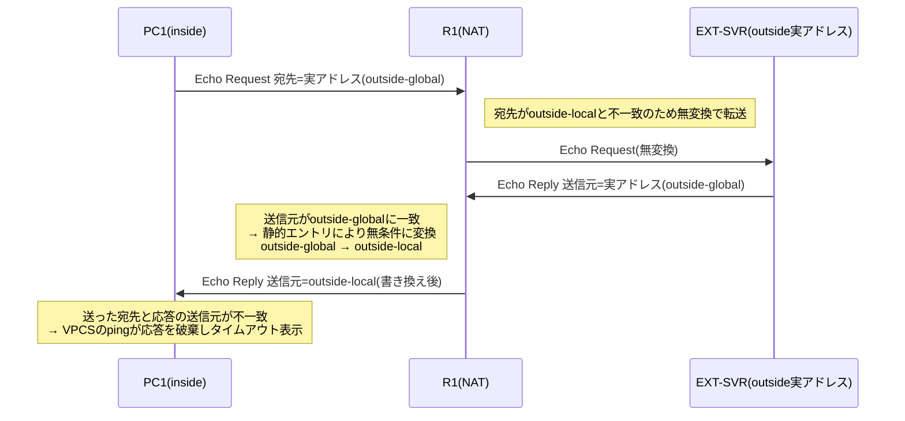

# 静的NAT(outside方向) 検証報告資料

- **報告日**: 2026-07-25
- **対象**: `ip nat outside source static` の動作検証
- **検証環境**: GNS3実機（ローカルサーバー、GNS3 v2.2.59 / R1 = Cisco IOSv 15.9(3)M12、PC1・EXT-SVR = VPCS）

## 1. 目的

「静的NAT」の検証として、既存の `ip nat inside source static`（内部ホストを外部公開）に加え、
対となる `ip nat outside source static`（外部の実ホストを、内部から見て別アドレスに
見せかける）を単体のトポロジーとして構築し、GNS3実機上で実際にパケットが想定通りに
流れるかを確認した。

## 2. 作成物一覧

| ファイル | 内容 | GNS3実機検証 |
|---|---|---|
| [`examples/static_nat_topology.yml`](../examples/static_nat_topology.yml) | inside側の静的NATのみ(PC1/SVR1をそれぞれ1:1で固定変換)。動的PAT(overload)は使用しない | 未実施(YAML作成のみ) |
| [`examples/static_nat_outside_topology.yml`](../examples/static_nat_outside_topology.yml) | outside側の静的NAT単体。inside/outsideが別アドレス空間(重複なし) | ✅ 実施済み(本資料4章) |
| [`examples/static_nat_outside_hostroute_topology.yml`](../examples/static_nat_outside_hostroute_topology.yml) | outside側の静的NAT + outside-localがinside側サブネットと重複するケース(参考: [infraexpert.com](https://www.infraexpert.com/study/natz6.html)) | ✅ 実施済み(本資料4章) |
| [`docs/static-nat-outside-packet-flow.md`](./static-nat-outside-packet-flow.md) | outside静的NATのパケットフロー図解(mermaid sequenceDiagram)と実機検証結果 | — |

## 3. 検証環境・手順

- GNS3サーバー: `http://127.0.0.1:3083`(ローカル)
- デプロイ: `gns3lab deploy <topology.yml>`
  - **既知の問題**: 同梱の `gns3lab.exe`(ビルド済みバイナリ)は versionが古く、
    `テンプレート 'vpcs' が見つかりません` で失敗する不具合を確認した。
    `venv\Scripts\python.exe -m gns3lab.cli deploy ...`(venv内の最新ソース)を使うことで
    正常にデプロイできた。恒久対応(exeの再ビルド)は未実施。
- R1(Cisco IOSv, QEMU)は `gns3lab deploy` のCLI自動投入が非対応のため、GNS3コンソール
  (telnet)へ直接接続し、各トポロジーYAMLの `config:` をそのまま手動投入した。
- 動作確認はPC1(VPCS)からの `ping` と、R1での `show ip route` / `show ip nat translations`
  / `show ip nat statistics` により実施した。

## 4. 検証結果サマリ

| No | 項目 | `static_nat_outside_topology.yml`(非重複) | `static_nat_outside_hostroute_topology.yml`(重複) |
|---|---|---|---|
| 1 | R1投入コンフィグの要点 | `ip nat outside source static 203.0.113.50 192.168.1.50 no-alias add-route` | `ip nat outside source static 10.1.1.10 192.168.1.20 no-alias` + `ip route 192.168.1.20 255.255.255.255 10.1.1.10` |
| 2 | 経路の自動/手動生成確認 | ✅ `add-route`により`192.168.1.50/32 via 203.0.113.50`が自動生成 | ✅ 手動`ip route`により`192.168.1.20/32 via 10.1.1.10`が反映 |
| 3 | PC1 → outside-localアドレス宛ping | ✅ 5/5成功(1.3〜3.8ms) | ✅ 5/5成功(1.1〜2.1ms) |
| 4 | PC1 → 実アドレス(outside-global)宛ping | ❌ 4〜5/5タイムアウト | ❌ 4/4タイムアウト |
| 5 | `show ip nat translations`(静的エントリ) | ✅ `--- --- 192.168.1.50 203.0.113.50` 常時存在 | ✅ `--- --- 192.168.1.20 10.1.1.10` 常時存在 |
| 6 | `show ip nat statistics` | ✅ static 1件、Hits増加、Misses: 0 | ✅ static 1件、dynamic 15件生成、Hits: 20、Misses: 0 |

**判定**: No.1〜3、5〜6は設計通り(合格)。No.4は「実アドレスへの直接到達」という
素朴な期待に反する結果であり、5章で詳述する。

## 5. 重要な技術的知見: 実アドレス宛pingがタイムアウトする理由

2つの異なるアドレス設計(非重複/重複)で**同一のパターン**が再現されたため、
これは `ip nat outside source static` に共通する一般的な性質であると判断できる。

- `ip nat outside source static` は特定のセッション単位ではなく、**一致するアドレスを
  持つパケットに常に無条件で適用される固定バインディング**である。
- そのため実アドレス宛に直接pingしても、EXT-SVRからの応答パケットがR1のoutside
  インターフェースを通過する時点で送信元が書き換えられ、PC1には
  outside-localアドレスからの応答として届く。
- R1側では両方向のパケットが正常に処理されている(`show ip nat translations verbose`で
  dynamic/extendedエントリの生成・期限切れと、`show ip nat statistics`のHits増加を確認済み)。
  **これはNATの不具合ではない。**
- 一方でPC1(VPCS)のpingクライアントは、送った宛先アドレスと応答の送信元アドレスが
  一致しないことを理由に応答を破棄し、結果としてタイムアウト表示になる。
  (ICMPの照合をID/シーケンス番号のみで行い送信元を見ないクライアント実装であれば
  成功しうるが、それは実装依存でありVPCSでは失敗する)

**結論**: `ip nat outside source static` の動作確認は、実アドレスではなく
**outside-localアドレス宛のping**で行うのが正しい検証方法である。

## 6. no-alias / add-route / 明示的ルートの使い分け

`ip nat outside source static` は既定では、outside-localアドレスがinside側の
接続サブネットに含まれる場合に暗黙のARPエイリアス応答を作成しようとするが、
この暗黙動作は状況依存で不確実なため、明示的に以下のいずれかを行うことを推奨する。

| 方式 | コマンド例 | 適用トポロジー |
|---|---|---|
| ① `no-alias add-route`(推奨・簡潔) | `ip nat outside source static <global> <local> no-alias add-route` | `static_nat_outside_topology.yml` |
| ② `no-alias` + 手動ルート(next-hop IP指定) | `ip nat outside source static <global> <local> no-alias`   `ip route <local> 255.255.255.255 <next-hop-ip>` | `static_nat_outside_hostroute_topology.yml` |
| ③ インターフェースのみの`ip route` | `ip route <local> 255.255.255.255 <interface>` | **非推奨**(P2Pリンクでのみ有効。GigabitEthernet等のマルチアクセス媒体では next-hop IPの指定が必須) |

## 7. 現在のGNS3上の状態

検証後もユーザー指示により以下2プロジェクトを起動状態のまま維持している。

| プロジェクト名 | 状態 | 用途 |
|---|---|---|
| `static_nat_outside_lab` | 起動中(opened) | `static_nat_outside_topology.yml` の検証環境 |
| `static_nat_outside_hostroute_lab` | 起動中(opened) | `static_nat_outside_hostroute_topology.yml` の検証環境 |

## 8. 未実施事項

- `examples/static_nat_topology.yml`(inside側静的NATのみ)はYAML作成のみで、
  本セッションではGNS3実機デプロイ・検証を行っていない。
- `gns3lab.exe`(コンパイル済みバイナリ)のテンプレート解決不具合は回避策(venv経由での
  実行)を確認したのみで、恒久修正(再ビルド)は未実施。
