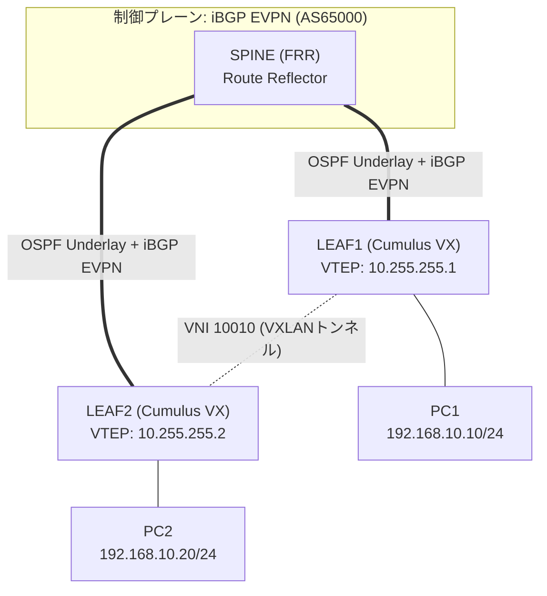

# VXLAN/EVPN ファブリック検証ネットワーク 基本設計書

- **対象トポロジー**: [`vxlan_evpn_topology.yml`](../examples/vxlan_evpn_topology.yml)
- **版数**: 1.1
- **ステータス**: **GNS3実機検証済み**（PC1-PC2間のVXLAN越しL2疎通、OSPF Full、BGP EVPN
  Established、EVPN Type-2/3ルート学習まで確認済み。検証結果は
  [詳細設計書 7章](./vxlan-evpn-detailed-design.md#7-試験項目結果)を参照）。検証の過程で
  判明した重要な注意点が複数あるため、必ず[7章](#7-前提条件制約事項)を読んでから構築すること

1台のRoute Reflector（RR）配下に2台のVTEP（VXLANトンネル終端点）をぶら下げ、EVPN
（Ethernet VPN, BGP address-family `l2vpn evpn`）で学習したMACアドレス情報をもとに、
物理的に離れた2つのL2セグメントをVXLANでストレッチする、Spine-Leaf型EVPNファブリックの
最小構成を検証する。

## 目次

1. [システム概要](#1-システム概要)
2. [ネットワーク全体構成](#2-ネットワーク全体構成)
3. [機器一覧・役割](#3-機器一覧役割)
4. [Underlay/Overlay設計方針](#4-underlayoverlay設計方針)
5. [VXLANデータプレーン方針](#5-vxlanデータプレーン方針)
6. [セキュリティ方針](#6-セキュリティ方針)
7. [前提条件・制約事項](#7-前提条件制約事項)

## 1. システム概要

### 1.1 目的

データセンターファブリックで一般的な「Underlay(IP到達性) + Overlay(BGP EVPN) + VXLAN
(データプレーン)」という3層構造を、最小構成（SPINE1台・LEAF2台）で実際にGNS3上に構築し、
EVPNによるL2セグメントの拠点間ストレッチが機能することを確認する。

- 🛰️ **Underlay**: OSPFでLoopback（VTEP/Router-IDに使用）間のIP到達性を確保する
- 🔁 **Overlay（制御プレーン）**: iBGP EVPN。SPINEをRoute Reflector（RR）とし、LEAF同士は
  フルメッシュを組まずRR経由でMAC/IPアドレス情報（EVPN Type-2）とVTEP情報（Type-3）を交換する
- 🚇 **データプレーン**: VXLAN。L2VNI 10010で、LEAF1配下・LEAF2配下それぞれのVLAN10を
  1つのブロードキャストドメインとしてストレッチする

### 1.2 適用範囲

SPINE（`SPINE`）、VTEP2台（`LEAF1`/`LEAF2`）、および各LEAF配下の検証用ホスト（`PC1`/`PC2`）
を対象とする。実際のデータセンターで必要となる複数VNI・複数SPINEによる冗長化・
Symmetric IRB（VXLAN越しのL3ルーティング）は本書のスコープ外とする（[7章](#7-前提条件制約事項)参照）。

## 2. ネットワーク全体構成

SPINEはLEAF1・LEAF2それぞれとP2Pリンクで接続し、OSPFで両LEAFのLoopback（VTEPソースIP）
への到達性を提供する。SPINEはBGP EVPNのRoute Reflectorとしてのみ動作し、VNIやVXLAN
インターフェースは持たない（データプレーンには参加しない、純粋な制御プレーンハブ）。
LEAF1/LEAF2はそれぞれVXLANトンネルの終端点（VTEP）となり、配下のPC1/PC2（同一サブネット
`192.168.10.0/24`）をVNI 10010でL2接続する。

## 3. 機器一覧・役割

| 機器名 | 役割 | 機種（テンプレート） | Loopback (Router-ID/VTEP) |
|---|---|---|---|
| `SPINE` | BGP EVPN Route Reflector（データプレーン非参加） | FRR 8.2.2 | `10.255.255.100/32` |
| `LEAF1` | VTEP、PC1収容 | Cumulus VX 5.4.0 | `10.255.255.1/32` |
| `LEAF2` | VTEP、PC2収容 | Cumulus VX 5.4.0 | `10.255.255.2/32` |
| `PC1` / `PC2` | 疎通確認用エンドホスト（同一サブネットをVXLAN越しに共有） | VPCS | — |

## 4. Underlay/Overlay設計方針

| レイヤ | 方式 | 説明 |
|---|---|---|
| Underlay | OSPF（単一エリア0） | SPINE-LEAF間のP2Pリンクと各ノードのLoopbackのみをOSPFに含め、VTEP間のIP到達性を確保する |
| Overlay（制御プレーン） | iBGP、AS 65000、address-family `l2vpn evpn` | SPINEをRoute Reflector、LEAF1/LEAF2をRRクライアントとする（LEAF同士のフルメッシュを回避） |
| VTEPピアリング | `update-source lo` | BGPセッションはLoopback同士で張り、物理リンク障害時の切替に強くする |

Route Reflectorを用いることで、LEAF台数が増えてもLEAF同士がフルメッシュでBGPセッションを
張る必要がなく、SPINEに1本ずつセッションを張るだけで済む（この最小構成では効果は見えにくいが、
実運用のスケール設計として一般的なEVPNパターンを踏襲する）。

## 5. VXLANデータプレーン方針

| 項目 | 値 | 説明 |
|---|---|---|
| L2VNI | `10010` | VXLAN Network Identifier |
| 対応VLAN | `VLAN 10` | LEAF配下のブリッジ内でVNI 10010とマッピング |
| ストレッチ対象サブネット | `192.168.10.0/24` | PC1（LEAF1配下）・PC2（LEAF2配下）が同一L2/L3セグメントとして通信する |
| VTEPソースIP | 各LEAFのLoopback | `net add vxlan vni10010 vxlan local-tunnelip <Loopback>` |
| VNI広告方式 | `advertise-all-vni` | LEAFが保持する全VNI情報をEVPN（Type-3, IMET route）でSPINE経由で広告する |

本構成はL2VNIのみで、VXLAN越しのL3ルーティング（Symmetric/Asymmetric IRB、Anycast Gateway）
は行わない。PC1-PC2間の疎通はあくまで「同一サブネット内のL2通信がVXLANでカプセル化されて
届く」ことの確認が目的である。

## 6. セキュリティ方針

本トポロジーは検証用の閉域構成であり、拠点間トラフィックの暗号化等は行わない。

| 項目 | 方針 |
|---|---|
| Underlay/Overlayの範囲 | GNS3上の閉じたトポロジーのみ（外部ネットワークとの接続なし） |
| BGPピア認証 | 本構成では省略（実運用ではMD5認証等の追加を推奨） |
| VNI分離 | VNIごとにブロードキャストドメインが分離されるため、他VNIを追加してもVLAN10のセグメントには影響しない設計 |

## 7. 前提条件・制約事項

- SPINE（FRR）/LEAF1・LEAF2（Cumulus VX）はいずれもQEMU系ノードのため、`gns3lab deploy`
  のCLI自動投入（dynamips/IOU/VPCS/SONiC-VS(`platform: sonic`)のみ対応）は非対応。
  設定はGNS3コンソールから手動投入する運用を前提とする（PC1/PC2のVPCSは自動投入対応）。
- **Cumulus VX 5.4.0のこのGNS3テンプレートではNCLU（`net add ...`）が使用不可**（実機検証で
  判明）。`net show`/`net help`は動くが、`net add`のプラグインからinterface/loopback/
  bridge/vxlan/bgpが除外されており「Command not found」になる。代替のNVUE（`nv`）も
  デーモン（`nvued`）がテンプレート既定のRAM（1024MB、実効723MB）ではOOM Killerに落ちて
  起動できない。**本設計はNCLU/NVUEを使わず、ifupdown2（`/etc/network/interfaces`）+
  vtyshを直接使う方式に変更済み**（[詳細設計書 6章](./vxlan-evpn-detailed-design.md#6-コンフィグ抜粋)参照）。
- **QEMUのadapter番号とCumulus VXのswpポート番号は1つズレる**（adapter0=eth0(mgmt)、
  adapter1=swp1、adapter2=swp2 ...）。`examples/vxlan_evpn_topology.yml`の`links:`は
  このズレを踏まえて調整済み。
- Cumulus VXの初回ログイン（`cumulus`/`cumulus`）はパスワード変更を強制される。
- SPINE（FRR、MTU 1500）とLEAF（Cumulus、MTU 9216）でMTUが異なるため、OSPFネイバーが
  `ExStart`で停止する。両側に`ip ospf mtu-ignore`が必須。
- VNIは10010（VLAN10）の1つのみとし、複数VNI・複数テナントの分離検証は対象外。
- SPINEは1台のみで、RRの冗長化（RR2台構成）は対象外。
- VXLAN越しのL3ルーティング（Anycast Gateway、Symmetric IRB）は対象外。あくまでL2VNIの
  疎通確認に限定する。

---

続きは [詳細設計書](./vxlan-evpn-detailed-design.md) を参照。
