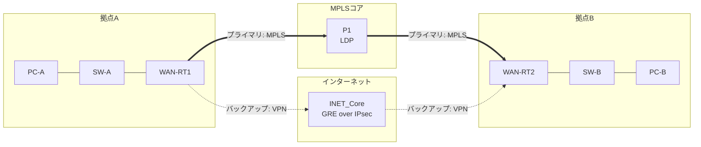

# WAN拠点間 冗長化ネットワーク 基本設計書

- **対象トポロジー**: [`wan_gre_mpls_redundancy.yml`](../wan_gre_mpls_redundancy.yml)
- **版数**: 1.0
- **ステータス**: GNS3実機検証済み（[試験結果は詳細設計書を参照](./wan-redundancy-detailed-design.md#6-試験項目結果)）

拠点A・拠点Bの2拠点間を、MPLS経路とインターネットVPN経路の2系統で接続し、片系障害時にも通信を継続させるための全体方針を定める。

## 目次

1. [システム概要](#1-システム概要)
2. [ネットワーク全体構成](#2-ネットワーク全体構成)
3. [機器一覧・役割](#3-機器一覧役割)
4. [冗長化方式](#4-冗長化方式)
5. [セキュリティ方針](#5-セキュリティ方針)
6. [前提条件・制約事項](#6-前提条件制約事項)

## 1. システム概要

### 1.1 目的

拠点A・拠点B間の基幹通信について、単一経路への依存によるサービス断リスクを排除するため、性質の異なる2つの経路を組み合わせた冗長構成を構築する。

- 🔵 **プライマリ**: MPLS網による拠点間接続（低遅延・低コスト経路）
- 🟠 **バックアップ**: インターネット経由のGRE over IPsec VPN（MPLS障害時の代替経路）

### 1.2 適用範囲

拠点Aルーター（WAN-RT1）、拠点Bルーター（WAN-RT2）、MPLSコアルーター（P1）、および両拠点のLANセグメントを対象とする。拠点内の詳細なLAN設計（VLAN分割等）は本書のスコープ外とする。

## 2. ネットワーク全体構成

拠点A・拠点Bのルーターは、MPLSコア（P1）を経由するプライマリ経路と、インターネットを介したGRE over IPsec VPNのバックアップ経路の両方で接続される。両経路はOSPFにより常時死活監視され、経路コストにより優先順位が制御される。

## 3. 機器一覧・役割

| 機器名 | 役割 | 機種（テンプレート） | 設置拠点 |
|---|---|---|---|
| `WAN-RT1` | 拠点Aエッジルーター（MPLS/VPN両対応） | Cisco IOSv 15.9(3)M12 | 拠点A |
| `WAN-RT2` | 拠点Bエッジルーター（MPLS/VPN両対応） | Cisco IOSv 15.9(3)M12 | 拠点B |
| `P1` | MPLSコアルーター（LDPラベルスイッチング） | Cisco IOSv 15.9(3)M12 | コア |
| `SW-A` / `SW-B` | 拠点内アクセススイッチ | Ethernet switch | 拠点A / 拠点B |
| `INET_Core` | インターネット代替セグメント（VPN対向点） | Ethernet switch | コア |
| `PC-A` / `PC-B` | 拠点内疎通確認用端末 | VPCS | 拠点A / 拠点B |

## 4. 冗長化方式

両拠点間はOSPF（エリア0）を単一の制御プレーンとして、MPLS経路・VPN経路の両方でルート情報を交換する。経路選択はOSPFのコスト値のみで制御し、経路の生死判定・切替判断を自動化する。

| 経路 | コスト | 説明 |
|---|---|---|
| 🔵 プライマリ（物理MPLS経路） | デフォルト（合計メトリック 約3） | 直接リンクのデフォルトコストのみを使用し、平常時は常にこちらを優先選択する |
| 🟠 バックアップ（Tunnel0 / GRE） | `1000`（明示設定） | `ip ospf cost 1000` を設定し、平常時は選択されないよう意図的に不利化する |

### 4.1 切替条件

- MPLS経路上の物理リンクまたはP1が停止し、OSPFがネイバーロストを検知した場合、自動的にTunnel0経由の経路へ切り替わる。
- MPLS経路が復旧すると、コストの低さにより自動的に経路が復帰する（フェイルバック）。
- 切替・復帰ともに追加の運用操作は不要（OSPFの自律動作のみで完結）。

## 5. セキュリティ方針

バックアップ経路はインターネットを経由するため、拠点間トラフィックはGREでカプセル化した上でIPsec（トランスポートモード）により暗号化・完全性保護する。プライマリのMPLS経路はキャリア閉域網を前提とし、追加の暗号化は行わない。

| 項目 | 設定値 |
|---|---|
| 鍵交換（IKEv1） | `AES-256` / `SHA-256` / DHグループ `14` / 事前共有鍵 |
| データ保護（IPsec） | `ESP AES-256` + `HMAC-SHA256`、トランスポートモード |
| 保護対象 | Tunnel0（GRE）を通過する拠点間IP通信全て |

## 6. 前提条件・制約事項

- 本設計はGNS3上のシミュレーション環境（Cisco IOSv）で検証したものであり、実機との細部の挙動差異（ライセンス制約・ASIC実装差等）は別途確認が必要。
- インターネット経路（INET_Core）の実際の帯域・遅延特性は本設計の対象外とし、静的な到達性のみを前提とする。
- 拠点ルーターはQEMU系ノードのため、`gns3lab` によるCLI自動投入は非対応。設定はコンソールから手動投入する運用を前提とする。

---

続きは [詳細設計書](./wan-redundancy-detailed-design.md) を参照。
